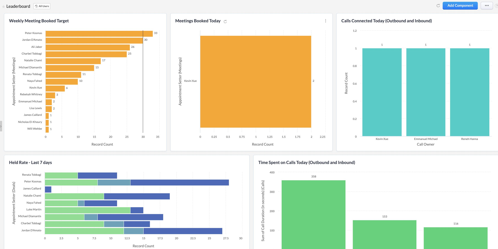

---

title: My first 6 months at St Trinity Property Group
date: 2021-05-27
description: Modest Self Reflections From Working In Fast-Paced Real Estate
tags:
  - Tutorial
slug: "/StTrinityPropertyGroup"
canonicalUrl: "https://www.alexmoses.com.au"

---

From the moment I stepped into the office at ST TRINITY, I knew I had found a close-knit team that would grow - if given the love and care it deserved. I signed the dotted line and started my Digital Marketing Specialist Role at ST TRINITY. That lasted a great 10 minutes before Nicholas, the founder and innovative mind behind the growth at ST TRINITY, moved me into the Development Team. My role switched to a Business Intelligence and DevOps role, where my focus was on creating optimisations and process innovations to support all teams within the business. I would work closely with the Marketing, Sales, Consultants, Accounts and Management teams, effectively building and maintaining the systems that keep the wheels turning at ST TRINITY. 

> Early in my career at ST TRINITY, Nicholas came into my room and said he wanted a leaderboard displayed on the office’s big TV. With the introduction of a live leaderboard,  sales callers could know where they stood in comparison to each other. 

My work in the Business Intelligence and DevOps spaces didn’t absolve me from the initial digital marketing role I applied for, however. I was reintroduced to the Digital Specialist role towards the end of my second week at ST TRINITY. I proved myself as a capable digital wizard, building a landing page for the Ridgewaters Kiama project within a matter of hours. My new landing page was far superior to the original landing page, both in terms of function and aesthetic. My page had a legendary conversion rate of almost 5% conversion rate, significantly above the industry average of 1.6% (property industry Australia-wide global is at 2.2%). 